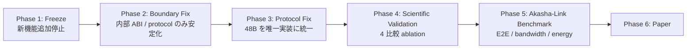

# ArcAsha-os 研究方針（Research Plan）

> 決定記録（2026-08-30）。外部レビューを踏まえた軌道修正。
> 結論: **機能を増やすフェーズは終了。検証フェーズへ移行する。**

## 0. 位置付けの再定義（最重要）

| リポジトリ | 位置付け | 役割 |
|---|---|---|
| **ArcAsha-os**（本リポジトリ） | Intelligence Runtime の**研究・実証環境** | AILSM / AILSA / AVM / Executive / Memory / Expert Evolution / Reasoning execution / Model abstraction |
| **Akasha-Link**（`akasha-link/`） | Distributed Tensor Execution Fabric の**研究・実証環境** | Tensor transport / Binary protocol / WebGPU / Remote execution / Node discovery / Fault tolerance |
| **Future Orchestrator**（将来の別リポジトリ） | 検証済み部品を統合する**本命システム** | Workload scheduling / Resource allocation / Model placement / Global policy |

**ArcAsha-os は「最終 AI OS」ではない。** 本命 AI システムに必要な Intelligence Runtime が「成立するか」を研究・実証する場。

## 1. 非統合方針

- ArcAsha と Akasha-Link を**今の段階で結合しない**（互いの存在を前提にしない）。
- ArcAsha は「AI reasoning / memory / execution architecture が成立するか」だけを研究する。
- Akasha-Link は「heterogeneous device 間で tensor workload を効率的に移送・実行できるか」だけを研究する。
- 両者が完成・検証された後に、**Future Orchestrator（新リポジトリ）**で統合する。
- 依存関係の向きを一方向に保つ（ArcAsha ← Future Orchestrator → Akasha-Link。ArcAsha → Akasha-Link の直接依存は作らない）。

## 2. フェーズロードマップ



- **Phase 1 — Freeze**: 新しい Attachment / Reasoning Mode / Memory / Executive / GPU backend の追加を停止。
- **Phase 2 — Boundary Fix**: ArcAsha 内部 ABI・Akasha-Link 内部 protocol のみ安定化。**将来の本命用の巨大 ABI は今作らない**（研究中にインターフェースを変えても本命側を壊さないため）。
- **Phase 3 — Protocol Fix**: `PROTOCOL.md`（48B header）を唯一の実装に統一。`client-web/src/worker.ts` の 20B legacy header を削除。**「コードが真実」**（Markdown はコードから生成）。
- **Phase 4 — Scientific Validation**: `Baseline / AVM only / Executive only / Full ArcAsha` の 4 比較。Accuracy / Latency / Token usage / Cost / Memory / Failure rate を計測。
- **Phase 5 — Akasha-Link Benchmark**: Local GPU vs WebGPU vs Remote で、Compute / Upload / Download / GPU / Network RTT / Queue / Total E2E / Energy を分離計測。
- **Phase 6 — Paper**: 検証結果を論文化。

## 3. やること / やらないこと

**やる:**
- 各コンポーネント（AILSM / AVM / Executive / Memory / Expert Evolution）の完成と検証
- Ablation Study（各コンポーネントの効果を因果的に示す）
- Baseline との比較・再現性・failure analysis
- 内部 API / ABI の安定化
- ドキュメント整理（AVM_RESULT.md など）

**やらない:**
- 本命 Orchestrator の実装（将来の別リポジトリ）
- Akasha-Link との強結合
- グローバル Resource Scheduler / distributed AI 全体の統合
- 複数プロジェクトをまたぐ巨大 ABI の先行設計
- 「AI OS だから全部ここに入れる」という拡張

## 4. 単体テストと科学的検証の分離

```
Unit Validation        Scientific Validation
├── Compiler correctness  ├── Accuracy
├── IR correctness        ├── Efficiency（token / cost / latency）
├── ABI correctness       ├── Generalization
└── Runtime correctness   └── 構成ごとの Ablation 比較
```

- `89 deterministic tests / golden 30 / build` はソフトウェア品質であって、**「AI OS として有効」の証明ではない**。この 2 つを混同しない。
- README の強い数字（例: 4.10x / −77% tokens）は**測定条件とセットで公開**する。
  - 最低限: Baseline / dataset / context length / retrieval quality / accuracy degradation / cache hit rate / workload distribution を `AVM_RESULT.md` に記載。

## 5. 既存の検証資産（ゼロからではない）

- **Caravan Ablation Benchmark**（`src/arcasha/cognitive/caravan-ablation.ts`, PR #24）: Base / Memory / Recovery / Memory+Recovery / Full の構成比較（successRate / avgLatency / avgTokens / avgCost / verificationPassRate / recoverySuccessRate / expertUtilization）
- **MetaOS 50 同時駆動**（`src/arcasha/bench/metaos-50.ts`, PR #26）: 50 体並列で V1〜V6（完走性/正しさ/学習/ルーティング/委譲/タイミング）を実 API 検証
- これらを Baseline（ArcAsha なし）との比較へ拡張するのが Phase 4 の入り口。

## 6. 中核仮説（1 つに絞る）

> **AILSM IR + Executive Runtime による動的 Reasoning Composition が、素の LLM に対して計測可能な改善をもたらすか**

これを中核とし、AVM / Attachments / Expert Evolution は「その上でどれだけ効くか」を ablation で示す。
