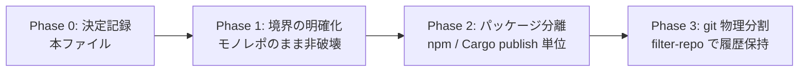

# Split Plan — Akasha-Link / ArcAsha-Core（MetaOS）

> 決定記録（2026-08-27）。モノレポ（Akasha-OS）を 2 つの独立プロジェクトへ分割する提案の実装計画。
> **状態: 実施中**（Phase 1/2 完了済み・git 物理分割のみユーザー確認後に実施）

## 1. 目的と役割分担

- **プロジェクトA「Akasha-Link」（仮称）** — エッジデバイス（WebGPU）での超低遅延・分散推論 / テンソル伝送エンジン
  - 切り出す: `akasha-client-web` / `akasha-kernel-native` / `PROTOCOL.md`（ワイヤプロトコル）
  - 目指す姿: AI の認知・思考は一切扱わない。**「サーバーから降ってきたテンソルを、スマホの WebGPU でいかに速く計算して送り返すか」**だけに特化した純粋な高速インフラ。WebGPU オーバーヘッド削減・5G/Wi-Fi での通信圧縮に集中。
- **プロジェクトB「ArcAsha-Core / MetaOS」（仮称）** — モデル非依存の AI オーケストレーション・OS レイヤー
  - 残す: `akasha-master` / `AI_REASONING.md` / `AI_COGNITIVE.md` / `AI_VIRTUAL_MEMORY.md`（AVM）ほか AI_*.md
  - 目指す姿: エッジが WebGPU である必要すらなく、**ローカルの MLX / クラウドの API（OpenAI / Anthropic 等）でも何でも繋げられる「思考プロセス制御フレームワーク」**。思考モード切替・AVM によるコンテキスト動的ページングを行う純粋なソフトウェア知能の司令塔。

## 2. 現状調査（2026-08-27 コード検証）

| 観点 | 事実 | 意味 |
|---|---|---|
| コード結合 | `akasha-master/src` は `client-web` / `kernel-native` を**一切 import しない**（grep 0 件） | B は既に A からコードレベルで独立 |
| client-web | dependencies が空の完全独立 npm パッケージ（WebGPU 推論 + ゼロコピー中継） | A として独立可 |
| kernel-native | 独立 Cargo プロジェクト（GPU compute / QUIC・TCP / メモリプール / platform） | A として独立可 |
| ビルド・CI | ルート package.json も `.github/workflows/ci.yml` も akasha-master のみ委譲 | A には CI が無い → 新設が必要 |
| 共有契約 | `PROTOCOL.md`（48B ヘッダ + f32[] ペイロードのバイナリワイヤ）が唯一の両者共有物 | 所有を決める必要がある |
| 重複 | `akasha-master/public/worker-inference.js` と `akasha-client-web/public/worker-inference.js` は**完全同一**（14,342B・ビルド成果物） | 最初に切るべき縫い目 |
| 参照 | master 側は `public/client.html` が worker を参照（`npm run edge`）。client 側は `index.html` / `src/main.ts` が参照 | 一本化時に参照を整理 |

**結論**: 分割は既存構造と自然に整合。境界はほぼ引かれており、唯一の実質的な「縫い目」は worker-inference.js の重複と PROTOCOL.md の所有。

## 3. 境界・所有の決定（案）

| 対象 | 所有 | 備考 |
|---|---|---|
| `worker-inference.js` | **A が一本化** | master の `build:edge` は A の成果物を参照する形へ整理 |
| `PROTOCOL.md` | **A が所有（B は依存）** | ワイヤプロトコルはエッジが実装する契約 |
| `NAMING.md` / `MASTER_SPEC.md` / `AI_*.md` | **B** | キャラバン世界観・思考制御は B |
| `.github/workflows/ci.yml` | 分割後は各リポジトリへ | 現行は B 用（A は新設） |
| `examples/` | B（プラグイン例） | 必要に応じ A へも複製可 |

## 4. 実施ロードマップ（推奨: 境界 → 分割）

- **Phase 0 — 決定記録**: 本ファイル ✅
- **Phase 1 — 境界の明確化（モノレポのまま・非破壊）** ✅（2026-08-27 実施）
  - ✅ `worker-inference.js` の重複確認（`akasha-master/public/` と `akasha-link/client-web/public/` は完全同一 14,342B）※一本化は B 側の参照整理後に実施
  - ✅ A 側 CI を新設（`.github/workflows/ci.yml` に `akasha-link` job: kernel-native `cargo check`+`cargo test` / client-web esbuild build）
  - ✅ ルート README に 2 プロジェクトの役割分担を記載（Project A = Akasha-Link / Project B = ArcAsha-Core・MetaOS）
  - ✅ `git mv` で A 資産を `akasha-link/` に集約（client-web / kernel-native / PROTOCOL.md。全ファイル `R`＝履歴保持）
  - ✅ `akasha-link/README.md` / `akasha-link/package.json`（A ルート: `build:link` / `test:link`）新設
  - ✅ ルート `package.json` に `build:link` / `test:link` 委譲を追加
  - ✅ CONTRIBUTING.md のパス参照を `akasha-link/...` へ更新
- **Phase 2 — パッケージ分離（publish 単位）**
  - 🔄 A: npm パッケージ（例: `akasha-link`）+ Cargo crate（例: `akasha-kernel`）※モノレポ内では `akasha-link/package.json` として確立済み。npm/Cargo publish はユーザー確認待ち
  - B: npm パッケージ（`arcasha` を継続）
- **Phase 3 — git 物理分割（要ユーザー確認）**
  - `git filter-repo --path akasha-master` → `arcasha-core`
  - `git filter-repo --path akasha-client-web --path akasha-kernel-native --path PROTOCOL.md` → `akasha-link`
  - 履歴は保持（統合コミット `fc08931` が起点）

## 5. リスク・留意点

- **git 物理分割は破壊的操作**。履歴・CI・開発フロー（PR #15〜#24 / CodeRabbit / AILSM selftest [1]-[89]）に影響 → **必ずユーザー確認後に実施**
- B は分割後も現行ワークフローをそのまま継続可能（資産の大部分は B 側）
- A は selftest / CI が未整備 → **独立テスト基盤を新設してから**独立プロジェクトとして公開
- 分割後も A（Akasha-Link）と B（ArcAsha-Core）は `PROTOCOL.md` を契約として疎結合に連携

## 6. 決定・次アクション

- [x] **命名確定**（2026-08-27 ユーザー指示「分散推論と、AIオーケストラ（異モデルAI分散MoE）に」）: A=**Akasha-Link**（分散推論）/ B=**ArcAsha-Core・MetaOS**（AI オーケストラ・異モデル AI 分散 MoE）
- [x] **Phase 1** 実施（git mv 集約 / A 側 CI 新設 / ルート README・package.json・CONTRIBUTING 更新 / `akasha-link/README.md`・`package.json` 新設）
- [ ] **Phase 3（git 物理分割）** の実施可否（ユーザー確認待ち・破壊的操作のため必須）
- [ ] A の PR（本分割を feature ブランチ → CodeRabbit → squash merge）
